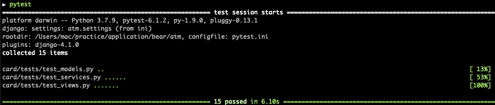

# Simple ATM controller implementation

## Assessment Requirements
Based on the following procedure,
- Insert Card
- Validate PIN number
- Select available account
- Select balacne/deposit/withdraw

** possible future bank api integration 
** possible future cash bin integration 
** code must be tested. 

## Introduction
For the possibility of third party integration, I decided to create a simple Django backend that can communicate through REST API. First, this backend would take request from a customer using an ATM. The enetered PIN would first be validated, and after the PIN has been confirmed, the user can proceed to the Balance/deposit/withdrawal phase. Layers have been separated for future expandability.

## models.py(persistence)
A simplified version of account data is stored in the database. The 'Card' class contains 'PIN' and 'Balance' information. This layer can be substitued with bank databases in the future.
The 'Bin' class contains balance information of a specific cash bin. Request withdrawal from the customer can only be done if he or she has enough balance in the card and the cash bin.

## view.py(presentation)
POST /card/validate : request access to account detail with 'card(number)' and 'pin' 
GET /card/balance   : request balance detail of the account 
POST /card/deposit  : request deposit to the account 
POST /card/withdraw : request withdrawal from the account 

** normally, card identification would be done with a token rather than pure id number, but in this project authorization process is not implemented - it would focus on the core components(validation & account manipulation)

## service.py(service)
Business logic functions in terms of withdrawing from the card and the cash bin. Logics are separated between the two, even though they share identical codes, for future integration.

## test
All functions in views.py, service.py, models.py are tested(except bin-related functions in service because they're identical to the card apis). Tests can be ran with __**pytest**__ in root directory.

